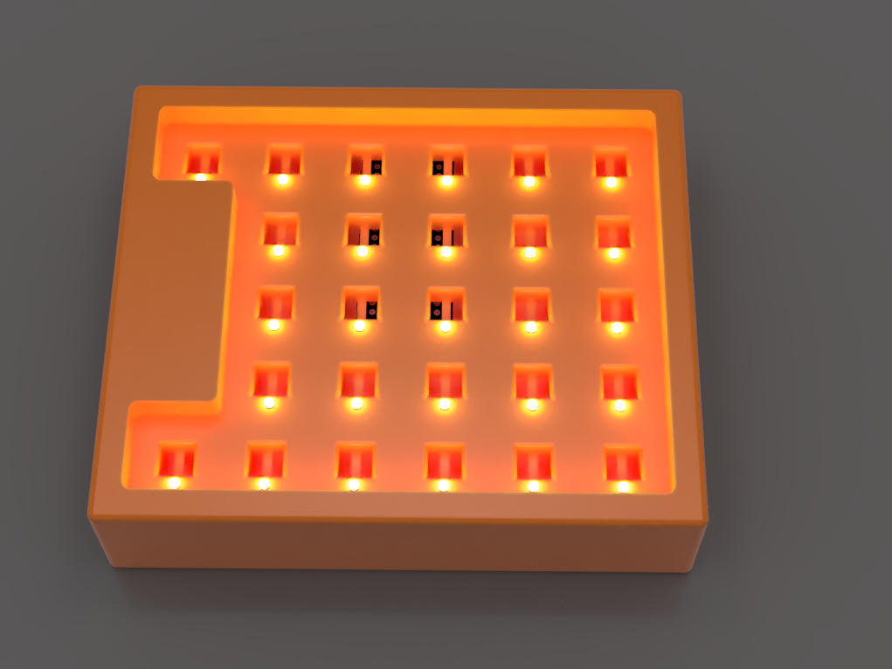

# BD Numpad

I recently purchased a 60% keyboard. It has served me well, and I appreciate how compact it is. However, it has also resulted in me needing to use complicated key combinations to accomplish the most basic tasks. For example, holding down the 'fn' key only to navigate using the arrow keys. Don't even get me started on having to enter numbers via the number row rather than the numpad.

## Design Considerations
I considered buying a mechanical numpad, but it wasn't in my budget at the time. I also needed some keys such as delete, home, and end. They come in handy when I'm programming. That's why I decided to build my own numpad. It also had to be extremely cheap; at the time, I was aiming for less than 200try, or 6.5 dollars.  That's why I went for HY-7070-W switches. They function like linear mechanical switches and only cost me 3 try for each switch, as opposed to 14try-17try for a standard mechanical switch. 

## Features

### Per Key Single Color Lighting
I haven't yet implemented the animations, so all keys will be illuminated at 100% until I do. The pins are already configured for individual control, so it shouldn't be too difficult to install in due course. 

### Onboard Micro USB
For the connection between a computer and the numpad, I'm using the built-in female micro USB socket. 

## Parts Needed
- STM32F108C8T6 "Bluepill" development board.

- 25 HY-7070-W switches.

- Micro USB cable.
- 3D printed pats.
